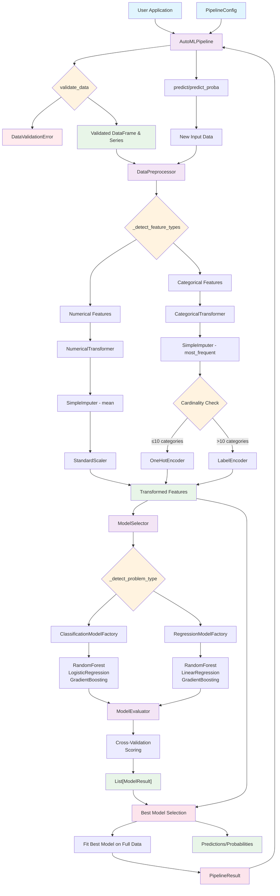

# AutoML Simple - Architecture Flow Diagram

## Corrected Mermaid Diagram

```mermaid
graph TD
    %% Entry Points
    User[User Application] --> Pipeline[AutoMLPipeline]
    Config[PipelineConfig] --> Pipeline

    %% Input Validation
    Pipeline --> Utils{validate_data}
    Utils --> DataError[DataValidationError]
    Utils --> ValidData[Validated DataFrame & Series]

    %% Preprocessing Phase
    ValidData --> Preprocessor[DataPreprocessor]
    Preprocessor --> FeatureDetection{_detect_feature_types}
    FeatureDetection --> NumFeatures[Numerical Features]
    FeatureDetection --> CatFeatures[Categorical Features]

    NumFeatures --> NumTransformer[NumericalTransformer]
    NumTransformer --> Imputer1[SimpleImputer - mean]
    Imputer1 --> Scaler[StandardScaler]

    CatFeatures --> CatTransformer[CategoricalTransformer]
    CatTransformer --> Imputer2[SimpleImputer - most_frequent]
    Imputer2 --> EncodingDecision{Cardinality Check}
    EncodingDecision -->|≤10 categories| OneHot[OneHotEncoder]
    EncodingDecision -->|>10 categories| Label[LabelEncoder]

    Scaler --> TransformedData[Transformed Features]
    OneHot --> TransformedData
    Label --> TransformedData

    %% Model Selection Phase
    TransformedData --> ModelSelector[ModelSelector]
    ModelSelector --> ProblemDetection{_detect_problem_type}
    ProblemDetection --> ClassFactory[ClassificationModelFactory]
    ProblemDetection --> RegFactory[RegressionModelFactory]

    ClassFactory --> ClassModels["RandomForest<br/>LogisticRegression<br/>GradientBoosting"]
    RegFactory --> RegModels["RandomForest<br/>LinearRegression<br/>GradientBoosting"]

    ClassModels --> Evaluator[ModelEvaluator]
    RegModels --> Evaluator

    Evaluator --> CrossVal["Cross-Validation<br/>Scoring"]
    CrossVal --> ModelResults["List[ModelResult]"]
    ModelResults --> BestModel[Best Model Selection]

    %% Results Generation
    BestModel --> FinalFit[Fit Best Model on Full Data]
    FinalFit --> PipelineResult[PipelineResult]
    PipelineResult --> Pipeline

    %% Prediction Phase
    Pipeline --> PredictMethod[predict/predict_proba]
    PredictMethod --> NewData[New Input Data]
    NewData --> Preprocessor
    TransformedData --> BestModel
    BestModel --> Predictions[Predictions/Probabilities]

    %% Styling
    classDef entry fill:#e1f5fe
    classDef process fill:#f3e5f5
    classDef decision fill:#fff3e0
    classDef data fill:#e8f5e8
    classDef result fill:#fce4ec
    classDef error fill:#ffebee

    class User,Config entry
    class Pipeline,Preprocessor,ModelSelector,Evaluator process
    class Utils,FeatureDetection,ProblemDetection,EncodingDecision decision
    class ValidData,TransformedData,ModelResults,Predictions data
    class PipelineResult,BestModel result
    class DataError error
```
